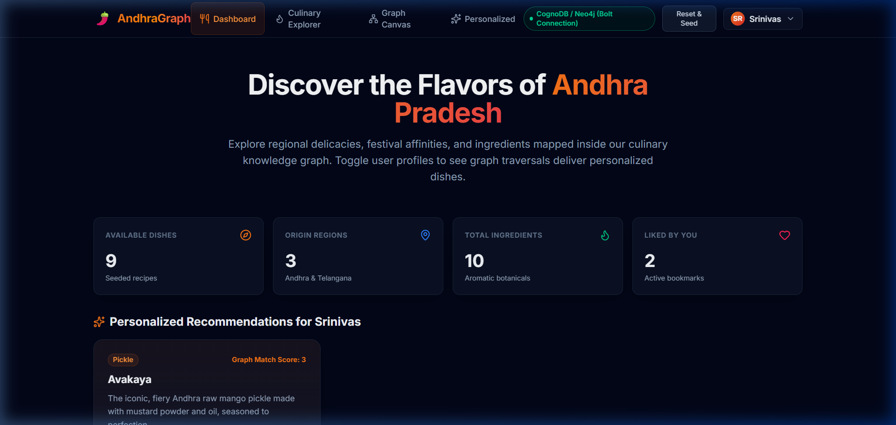
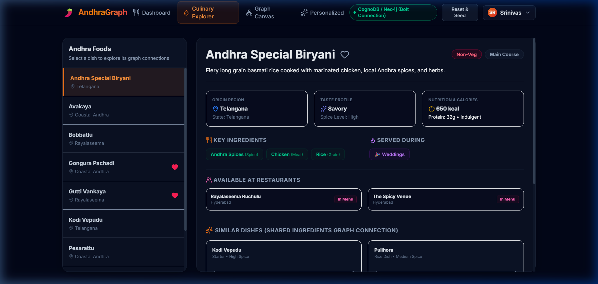
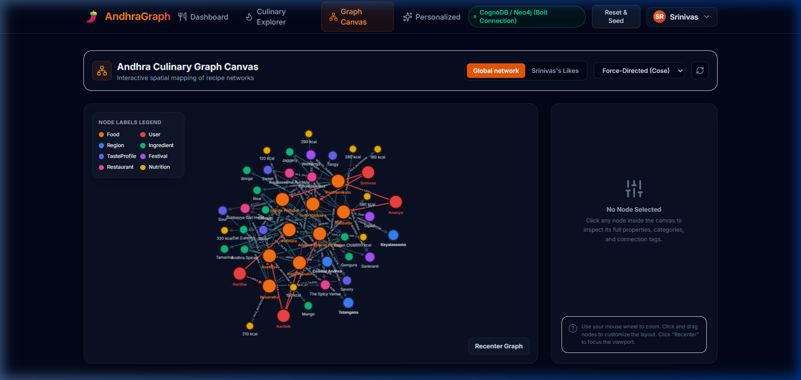
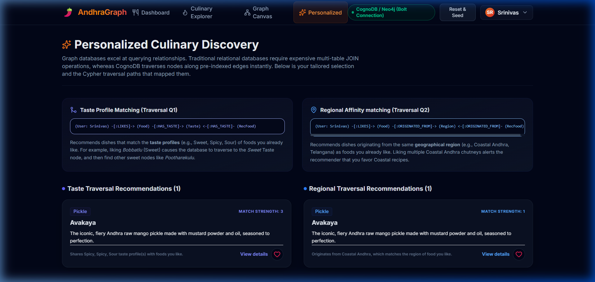
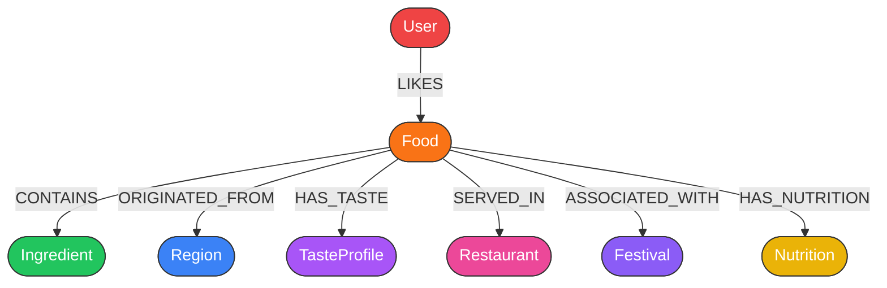

# 🌶️ Andhra Culinary Knowledge Graph & Personalized Discovery Platform

An interactive, graph-based culinary discovery and recommendation engine built for **Wexa AI – CognoDB Assignment 2**. 

This application demonstrates the architectural and performance advantages of a graph database (**CognoDB Cloud / Neo4j**) over traditional relational databases for deeply connected data. It uses the official Neo4j driver with the Bolt protocol, parameterized Cypher queries, and features an interactive **Cytoscape.js** visualization canvas.

---

## 📷 App Showcase (UI/UX)

| 📊 Interactive Dashboard | 🔍 Culinary Explorer Drawer |
| :---: | :---: |
|  |  |
| **🕸️ Cytoscape Graph Canvas** | **✨ Cypher Traversal Explainer** |
|  |  |

---

## 🌐 Live Hosted Demo & Walkthrough
*   **Hosted Application URL:** [https://wexaai-culinary.vercel.app/](https://wexaai-culinary.vercel.app/)
*   **Walkthrough Video (Google Drive):** [Walkthrough Recording Link](https://drive.google.com/file/d/10Nl-lIpm3TanDjDViHFA-b8ohslqTx5X/view?usp=sharing)

---

## ❓ Why a Graph Database? (Relational vs. Graph)

Traditional relational databases struggle when querying **complex, multi-hop connections** because they rely on JOIN tables. As the dataset size grows, the number of table scans increases exponentially, resulting in "Join Hell."

### 1. The Relational "Join Hell" (SQL)
To find recommendations based on shared taste profiles of liked foods for user "Srinivas" in SQL, you have to execute multiple joins across bridge tables:
```sql
SELECT DISTINCT f_rec.* 
FROM users u
JOIN user_likes ul ON u.id = ul.user_id
JOIN foods f_liked ON ul.food_id = f_liked.id
JOIN food_tastes ft_liked ON f_liked.id = ft_liked.food_id
JOIN food_tastes ft_rec ON ft_liked.taste_id = ft_rec.taste_id
JOIN foods f_rec ON ft_rec.food_id = f_rec.id
WHERE u.name = 'Srinivas' 
  AND f_rec.id NOT IN (SELECT food_id FROM user_likes WHERE user_id = u.id);
```
*   **Performance:** `O(N^K)` where `N` is table size and `K` is the number of joins. This query becomes sluggish as user likes and foods scale.

### 2. Graph Traversal (Cypher)
By utilizing **index-free adjacency**, graph databases traverse memory pointers directly along pre-indexed relationships:
```cypher
MATCH (u:User {name: $username})-[:LIKES]->(f:Food)-[:HAS_TASTE]->(t:TasteProfile)<-[:HAS_TASTE]-(rec:Food)
WHERE NOT (u)-[:LIKES]->(rec)
RETURN rec, count(t) as score
ORDER BY score DESC;
```
*   **Performance:** `O(D)` where `D` is the depth of path traversal. It executes in milliseconds, **completely independent** of the database size.

---

## 📐 Graph Schema Model

Our graph models the rich culinary heritage of Andhra cuisine using **8 labeled nodes** and **7 typed relationships**:



### Labeled Nodes & Properties
1.  **User**: `id`, `name`, `food_preference` (Veg/Non-Veg), `spice_preference` (Low/Medium/High)
2.  **Food**: `id`, `name`, `category` (Main Course/Pickle/Sweet), `vegetarian` (boolean), `spice_level`, `description`
3.  **Ingredient**: `id`, `name`, `category` (Spice/Herb/Grain/Vegetable)
4.  **Region**: `id`, `name` (Coastal Andhra/Rayalaseema/Telangana), `state`
5.  **TasteProfile**: `id`, `taste` (Sour/Spicy/Sweet/Savory)
6.  **Festival**: `id`, `name` (Ugadi/Sankranti/Dussehra)
7.  **Restaurant**: `id`, `name`, `location`
8.  **Nutrition**: `calories` (int), `protein` (string), `health_type` (Healthy/Indulgent)

---

## ☁️ Setting Up CognoDB Cloud

1.  **Sign Up:** Go to [console.cognodb.com/signup](https://console.cognodb.com/signup) and create a free account.
2.  **Create Instance:** Provision a free (c0) database instance in your preferred region.
3.  **Save Credentials:** Copy the Bolt connection URI (e.g. `bolt+s://<instance-id>.databases.cognodb.cloud`) and password.
4.  **Configure Env:** Paste the credentials into your `backend/.env` file:
    ```env
    COGNODB_URI=bolt+s://<instance-id>.databases.cognodb.cloud
    COGNODB_USERNAME=cognodb
    COGNODB_PASSWORD=your_saved_password
    COGNODB_MOCK_FALLBACK=false
    ```

---

## 🛠️ Local Installation & Setup

### 1. Backend API (FastAPI)
```bash
cd backend
python -m venv venv
source venv/Scripts/activate # Windows: .\venv\Scripts\activate

# Install dependencies
pip install -r requirements.txt

# Run database seeder (seeds all nodes and relations)
python seed.py

# Launch server
python main.py
```
*   *Note: If CognoDB Cloud credentials are not configured, the system automatically falls back to an in-memory mock graph server so you can test E2E immediately.*

### 2. Frontend SPA (React + Vite)
```bash
cd frontend
npm install
npm run dev
```
Open [http://localhost:5173/](http://localhost:5173/) to explore.

---

## 💾 Core Cypher Queries (100% Parameterized)

All database operations are fully parameterized to optimize plan caching and prevent Cypher injection attacks:

### Q1: Multi-Hop Personalized Taste Recommendations
Finds un-liked foods sharing taste profiles of foods the user already likes, matching spice and veg preferences:
```cypher
MATCH (u:User {name: $username})-[:LIKES]->(f:Food)-[:HAS_TASTE]->(t:TasteProfile)
MATCH (rec:Food)-[:HAS_TASTE]->(t)
WHERE NOT (u)-[:LIKES]->(rec)
  AND (u.food_preference = 'Any' OR rec.vegetarian = (u.food_preference = 'Veg'))
  AND (u.spice_preference = 'Any' OR rec.spice_level = u.spice_preference)
RETURN rec.id AS id, rec.name AS name, rec.category AS category, 
       rec.vegetarian AS vegetarian, rec.spice_level AS spice_level, 
       rec.description AS description, count(t) AS strength
ORDER BY strength DESC
LIMIT $limit;
```

### Q2: Recipe Ingredient Similarity (Collaborative Filtering Style)
Finds alternative dishes that share the maximum number of overlapping ingredients:
```cypher
MATCH (f1:Food {id: $food_id})-[:CONTAINS]->(i:Ingredient)<-[:CONTAINS]-(f2:Food)
RETURN f2.id AS id, f2.name AS name, f2.category AS category, 
       f2.vegetarian AS vegetarian, f2.spice_level AS spice_level, 
       f2.description AS description, count(i) AS shared_ingredients_count,
       collect(i.name) AS shared_ingredients
ORDER BY shared_ingredients_count DESC
LIMIT $limit;
```

### Q3: Subgraph Visualization Retrieval
Retrieves all neighbor nodes and relationship pointers to build Cytoscape.js nodes and edges maps:
```cypher
MATCH (n)-[r]->(m)
WHERE labels(n)[0] IN ['Food', 'Ingredient', 'Region', 'Festival', 'TasteProfile', 'Restaurant']
  AND labels(m)[0] IN ['Food', 'Ingredient', 'Region', 'Festival', 'TasteProfile', 'Restaurant']
RETURN n, r, m
LIMIT $limit;
```

---

## 📁 Repository Structure
```text
├── backend/
│   ├── routes/              # FastAPI Router Controllers (foods, users, recs, graph)
│   ├── services/            # Neo4j Database Service Layer wrapper
│   ├── queries/             # Parameterized Cypher statements
│   ├── models/              # Pydantic Schemas
│   ├── database.py          # Neo4j GraphDatabase Driver Initialization
│   ├── seed.py              # Initial graph seeder script
│   └── main.py              # FastAPI entrance file
├── frontend/
│   ├── src/
│   │   ├── components/      # UI Elements & Cytoscape Graph Canvas
│   │   ├── pages/           # Dashboard, Explorer, Personalized Recommendations
│   │   └── App.tsx          # Navigation router
│   ├── package.json
│   └── vite.config.ts
├── screenshots/             # Interface screenshots for README
└── README.md
```
